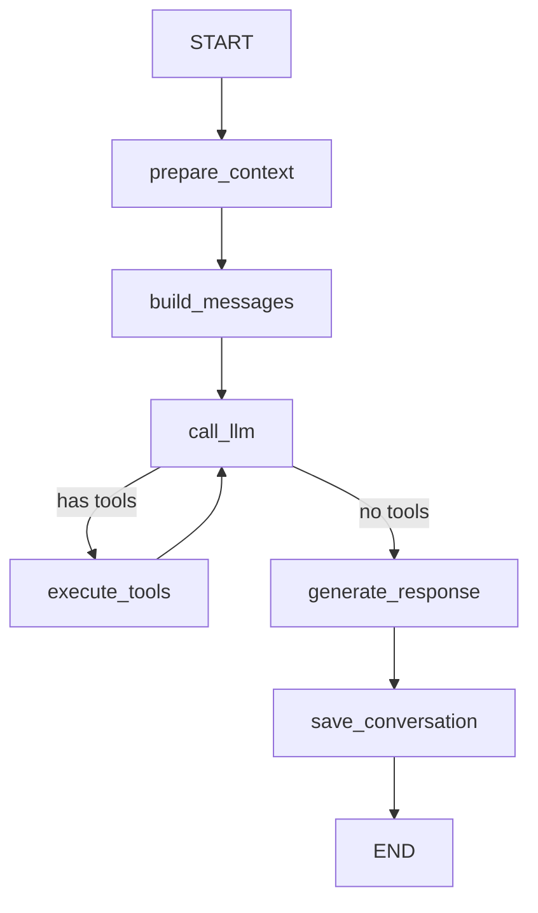

# LangGraph 迁移方案

## 概述

将 `agent.py` 的 `run` 方法从手动流式处理迁移到 LangGraph StateGraph 架构。

## 当前状态

### 现有实现 (agent.py)
- ✅ 手动 `async for` 循环处理节点
- ✅ 直接操作局部变量 (output, turn, total_tools)
- ✅ 内联的条件判断 (if node == "llm")
- ✅ 完整的工具调用和追踪逻辑

### LangGraph 原型 (agent_graph.py)
- ✅ State 定义 (AgentState)
- ✅ 节点函数框架
- ✅ Graph 构建逻辑
- ⚠️ LLM 调用逻辑未实现
- ⚠️ 工具执行逻辑未实现
- ⚠️ 流式输出未实现

## 架构对比

### 当前架构
```python
async def run(prompt, history):
    # 准备上下文
    history = prepare_context(history, prompt)

    # 构建消息
    messages = build_messages(history, prompt)

    # 流式处理
    async for step in agent.astream(messages):
        for node, state in step.items():
            if node == "llm":
                handle_llm_node(state)
            elif node == "tools":
                handle_tools_node(state)

    # 补充响应
    if not output:
        output = generate_fallback()

    # 保存对话
    save_conversation(history, prompt, output)

    return output
```

### LangGraph 架构
```python
# 定义状态
class AgentState(TypedDict):
    prompt: str
    history: list
    messages: list
    output: str
    turn: int
    ...

# 定义节点
def prepare_context_node(state): ...
def build_messages_node(state): ...
def call_llm_node(state): ...
def execute_tools_node(state): ...
def generate_response_node(state): ...
def save_conversation_node(state): ...

# 构建图
workflow = StateGraph(AgentState)
workflow.add_node("prepare", prepare_context_node)
workflow.add_node("build", build_messages_node)
workflow.add_node("llm", call_llm_node)
workflow.add_node("tools", execute_tools_node)
workflow.add_node("response", generate_response_node)
workflow.add_node("save", save_conversation_node)

# 设置路由
workflow.set_entry_point("prepare")
workflow.add_edge("prepare", "build")
workflow.add_edge("build", "llm")
workflow.add_conditional_edges("llm", should_use_tools, {
    "tools": "tools",
    "response": "response"
})
workflow.add_edge("tools", "llm")  # 循环
workflow.add_edge("response", "save")
workflow.add_edge("save", END)

# 编译并运行
graph = workflow.compile()
result = await graph.ainvoke(initial_state)
```

## 优势

### 1. 状态管理清晰
- **现在**: 多个局部变量 (output, turn, total_tools, messages, ...)
- **LangGraph**: 单一 State 对象，自动在节点间传递

### 2. 流程可视化
```python
# 可以导出 Mermaid 图
graph.get_graph().draw_mermaid()
```



### 3. 条件路由
- **现在**: `if node == "llm"` / `elif node == "tools"`
- **LangGraph**: `add_conditional_edges(should_use_tools)`

### 4. 可测试性
- 每个节点函数独立，易于单元测试
- 可以 mock State 进行测试

### 5. 可扩展性
- 添加新节点不影响现有逻辑
- 可以插入中间节点（如日志、监控）

## 挑战

### 1. 流式输出
**问题**: LangGraph 的 `ainvoke` 是一次性返回，不支持流式输出

**现有实现**:
```python
async for step in agent.astream(messages):
    # 实时处理每个节点的输出
```

**解决方案**:
- 使用 LangGraph 的 `astream` 或 `astream_events`
- 在节点内部处理流式输出

### 2. 嵌套 Agent 调用
**问题**: `call_llm_node` 内部需要调用 `context.get_agent().astream()`

**现有实现**:
```python
async for step in self.context.get_agent().astream(messages):
    # 处理 LLM 和工具节点
```

**解决方案**:
- 将内部 agent 的节点展开到外层 Graph
- 或者在 `call_llm_node` 中完整处理内部循环

### 3. 工具调用循环
**问题**: LLM → Tools → LLM 的循环需要正确处理

**解决方案**:
```python
workflow.add_conditional_edges("llm", should_use_tools, {
    "tools": "tools",
    "response": "response"
})
workflow.add_edge("tools", "llm")  # 循环回 LLM
```

### 4. 依赖注入
**问题**: 节点函数需要访问 context, notification_service 等

**解决方案**:
```python
# 使用 lambda 绑定依赖
workflow.add_node("prepare",
    lambda s: prepare_context_node(s, context, notification_service))
```

## 实现步骤

### Phase 1: 基础框架 ✅
- [x] 定义 AgentState
- [x] 创建节点函数框架
- [x] 构建 StateGraph
- [x] 设置路由逻辑

### Phase 2: 核心逻辑迁移 ⏳
- [ ] 实现 `call_llm_node` 的完整逻辑
  - [ ] 调用 context.get_agent()
  - [ ] 处理流式输出
  - [ ] 记录 prompt 和响应
  - [ ] 追踪工具调用
- [ ] 实现 `execute_tools_node` 的完整逻辑
  - [ ] 执行工具
  - [ ] 记录结果
  - [ ] 更新守卫状态
  - [ ] 偏离检测
- [ ] 实现 `generate_response_node` 的补充调用逻辑

### Phase 3: 集成测试 ⏳
- [ ] 单元测试每个节点
- [ ] 集成测试完整流程
- [ ] 对比现有实现的输出
- [ ] 性能测试

### Phase 4: 切换 ⏳
- [ ] 在 AgentService 中添加 `use_langgraph` 配置
- [ ] 保留现有 `run` 方法作为 fallback
- [ ] 逐步迁移到 LangGraph 版本

## 代码示例

### 完整的 call_llm_node 实现

```python
async def call_llm_node(state: AgentState, context: AgentContext) -> AgentState:
    """调用 LLM 并处理响应"""
    state["turn"] += 1
    tracer = state["tracer"]

    print(f"🧠 [第 {state['turn']} 次调用 LLM] 上下文消息数={len(state['messages'])}")

    # 调用内部 agent
    agent = context.get_agent()

    # 流式处理
    async for step in agent.astream({"messages": state["messages"]}, stream_mode="updates"):
        for node, node_state in step.items():
            if node in ("agent", "call_model", "llm"):
                last = node_state["messages"][-1]
                state["last_state_messages"] = node_state["messages"]

                # 记录 prompt
                prompt_messages = [...]
                tracer.emit("llm.prompt", turn=state["turn"], messages=prompt_messages)

                # 记录响应
                response_data = {"content": last.content[:500]}
                if getattr(last, "tool_calls", None):
                    response_data["tool_calls"] = [...]
                    # 注册工具调用
                    for tc in last.tool_calls:
                        call_id = tc.get("id") or tc["name"]
                        state["pending_calls"][call_id] = {
                            "tool": tc["name"],
                            "t_start": time.time()
                        }
                else:
                    # 直接回答
                    state["output"] = last.content

                tracer.emit("llm.response", turn=state["turn"], **response_data)

    return state
```

### 完整的 execute_tools_node 实现

```python
async def execute_tools_node(state: AgentState, context: AgentContext,
                             todo_reminder: TodoReminderGuard,
                             reflection_gate: ReflectionGatekeeper,
                             monitor) -> AgentState:
    """执行工具并更新状态"""

    # 获取工具调用结果（从内部 agent 的 tools 节点）
    # 这里需要访问工具执行结果

    # 简化版：假设工具结果已经在 state 中
    tool_result = state.get("current_tool_result")

    if tool_result:
        content_str = tool_result["content"]
        tool_name = tool_result["name"]
        call_id = tool_result["call_id"]

        print(f"📥 [{tool_name}] 返回: {content_str[:80]}")

        # 添加到摘要
        state["tool_results_summary"].append(content_str[:500])
        state["total_tools"] += 1

        # 标记进度
        monitor.mark_step_done()

        # 偏离检测
        if monitor.should_check(state["total_tools"], check_interval=3):
            check = await monitor.check_on_track(context.get_overflow_guard()._llm)
            if not check.get("on_track", True):
                print(f"⚠️ 偏离检测: {check.get('reason')}")

        # 更新守卫
        todo_reminder.on_tool_call(tool_name)

        # 提取 subagent_type
        subagent = ""
        if tool_name == "Task":
            # ... 提取逻辑
            pass
        reflection_gate.on_tool_call(tool_name, subagent, content_str)

        # 保存到 transcript
        context.get_store().save_tool_result("main", tool_name, call_id, content_str)

    return state
```

## 决策点

### 是否迁移到 LangGraph？

**优势**:
- ✅ 代码结构更清晰
- ✅ 状态管理更简单
- ✅ 流程可视化
- ✅ 易于测试和扩展

**劣势**:
- ❌ 需要重写核心逻辑
- ❌ 流式输出处理复杂
- ❌ 嵌套 agent 调用需要特殊处理
- ❌ 学习曲线

### 建议

**短期**: 保持现有实现，继续优化
- 现有代码已经很好地模块化
- AgentRun 对象已经封装了状态
- 性能和功能都满足需求

**长期**: 考虑迁移到 LangGraph
- 当需要更复杂的流程控制时
- 当需要可视化和调试工具时
- 当团队熟悉 LangGraph 后

## 参考资料

- [LangGraph 文档](https://langchain-ai.github.io/langgraph/)
- [StateGraph 示例](https://langchain-ai.github.io/langgraph/tutorials/introduction/)
- [条件路由](https://langchain-ai.github.io/langgraph/how-tos/branching/)
- [流式输出](https://langchain-ai.github.io/langgraph/how-tos/streaming-tokens/)
